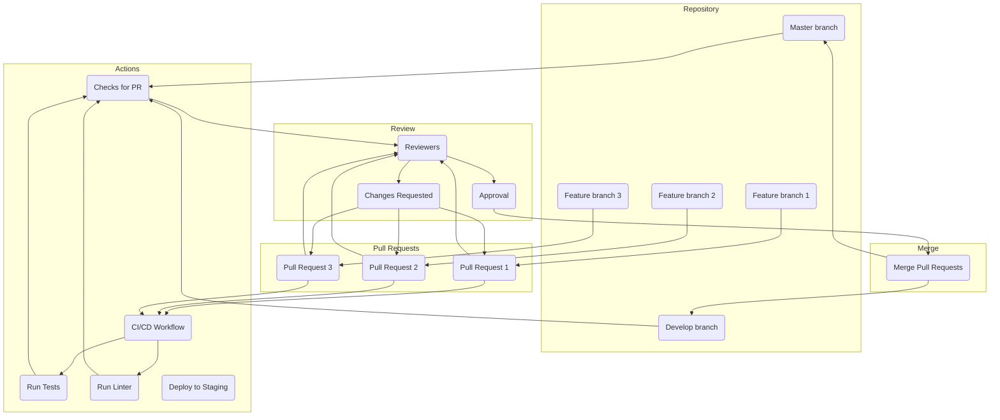

---

## 🌌 Embrace Your Quest

* **Fork the Repository**: Begin your journey by forking this repository to your own enchanted realm.

* **Clone the Repository** : Delve into the depths of code by cloning the repository to your local machine.

* **Install Dependencies** : Harness the powers of the required dependencies, ensuring you have all the spells needed.

* **Create Your New Branch** : Forge your path by creating a new branch for your magical changes.
  

## 🧚‍♀️ Weave Your Magic

* **Dive into Your Magic** : Channel your inner sorcery and weave your code magic into the project.

* **Run the Enchanted Tests** : Unleash the mystical tests to ensure your spells work as expected.

* **Perform the Enchanted Commit** : Capture your changes in a magical incantation called a commit.

* **Push the Magic** : Send your enchanted changes back to your forked realm.

 ##  🧙‍♂️ Summon the Elders
 
* **Summon the Pull Request** : Conjure a pull request, calling forth your changes to be reviewed.

* **Experience the Glorious Code Review** : The elders will provide valuable feedback and guidance to enhance your sorcery.

* **Merge the Wondrous Changes** : Once your magic has been approved, the elders will merge your changes into the main repository.
