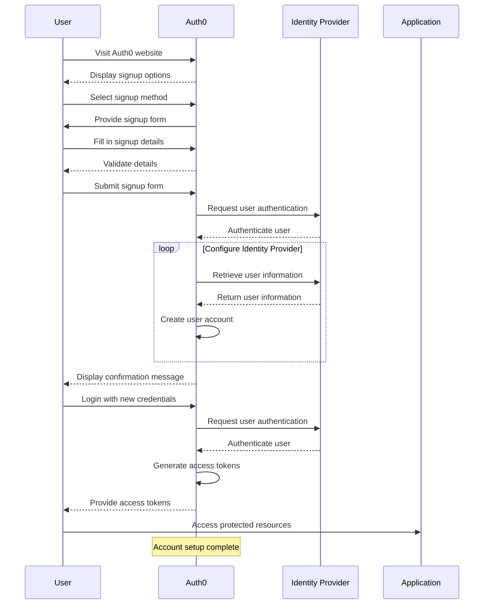

# 👤 Account Setup Guide

This guide will walk you through the initial steps of setting up your Auth0 account. By following these instructions, you'll be able to create an account, access the Auth0 dashboard, and manage your applications and configurations effectively.

## 📝  Creating an Auth0 Account

To get started with Auth0, follow these steps to create your account:

1. **Visit the Auth0 website:** Go to the [Auth0 website](https://auth0.com) using your preferred web browser.

2. **Click on "Get Started" or "Sign Up":** Look for the "Get Started" or "Sign Up" button on the Auth0 homepage and click on it.

3. **Provide your email and password:** Enter your email address and create a strong, secure password for your Auth0 account.

4. **Complete the verification process:** Follow the instructions sent to your email to complete the verification process and confirm your account.

5. **Provide additional information:** Once your account is verified, you'll be prompted to provide additional information, such as your name and organization. Fill in the required details and proceed.

Congratulations! You have successfully created your Auth0 account. Now, let's move on to accessing the Auth0 dashboard.

## 🖥️ Accessing the Auth0 Dashboard

The Auth0 dashboard is where you manage your applications, configure authentication settings, and access various resources. To access the dashboard:

1. **Log in to your Auth0 account:** Visit the [Auth0 website](https://auth0.com) and click on the "Log In" button. Enter your email and password to log in to your account.

2. **Navigate to the dashboard:** After logging in, you'll be redirected to the Auth0 dashboard automatically. If you're not redirected, click on the "Dashboard" link in the top navigation bar.

Now, you're ready to explore the Auth0 dashboard and start managing your applications and configurations.

## 🚀  Navigating the Auth0 Dashboard

The Auth0 dashboard provides a user-friendly interface to manage your applications and configure authentication settings. Here's an overview of the key sections and features within the dashboard:

- **Applications:** The "Applications" section allows you to view, create, and manage your applications. You can configure various settings for each application, including allowed callback URLs, allowed logout URLs, application type, and more.

- **Connections:** In the "Connections" section, you can configure different identity providers and connection types. This includes username/password databases, social identity providers (such as Google, Facebook, etc.), enterprise identity providers (such as Active Directory), and more.

- **Rules and Hooks:** The "Rules" and "Hooks" sections enable you to customize the authentication and authorization process with custom logic and extensibility. You can add rules to execute specific actions during authentication, or use hooks to extend Auth0's behavior during different stages of the authentication flow.

- **APIs:** If your application requires access to protected APIs, the "APIs" section allows you to define and manage your APIs within Auth0. You can configure API identifiers, scopes, permissions, and integrate authorization rules for secure API access.

Take some time to explore the Auth0 dashboard and familiarize yourself with the available options and features. This will help you effectively manage your applications and make the most of Auth0's capabilities.

## 🚀 Next Steps

With your Auth0 account created and the dashboard accessed, you're now ready to start integrating Auth0 into your applications. Consider exploring the [Getting Started](../README.md) guide in this repository to find detailed instructions, sample projects, and resources that will help you get up and running quickly.

If you have any questions or need assistance, don't hesitate to consult the official [Auth0 documentation](https://auth0.com/docs) or reach out to the vibrant [Auth0 community](https://community.auth0.com/). Auth0's extensive resources and helpful community will provide you with the support you need to successfully leverage Auth0's identity and access management platform.

Happy account setup and exploring with Auth0!
