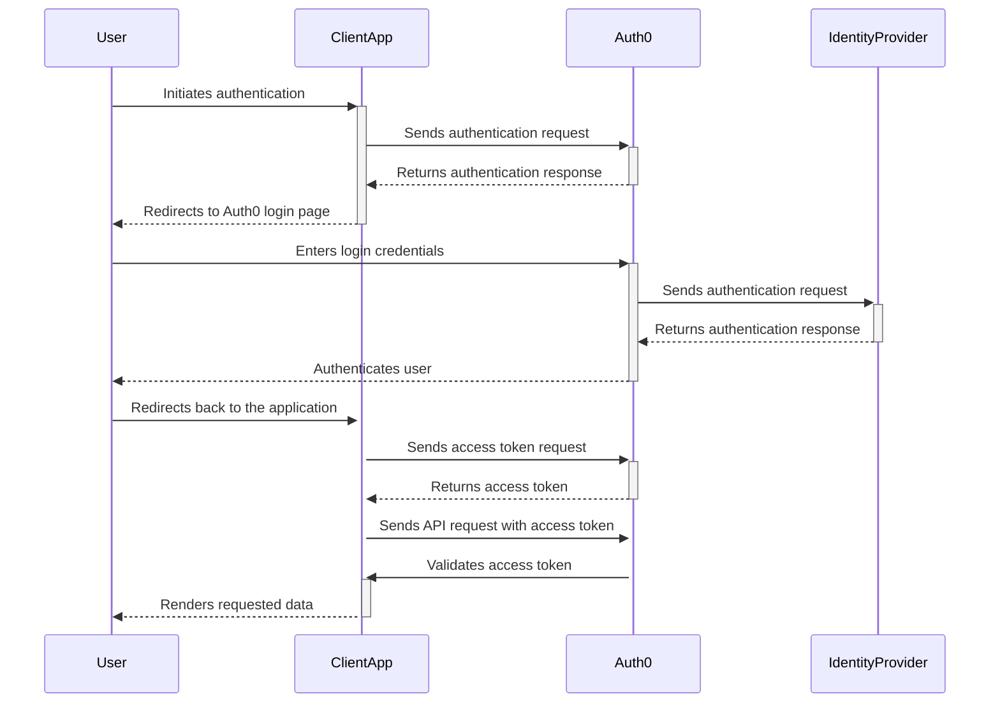

# 🔧🚀 Configuration Guide

This guide will walk you through the configuration steps required to integrate Auth0 into your application. It covers essential settings and configurations that will enable seamless authentication and authorization using Auth0's identity and access management (IAM) platform.

---

## 🛠️ Auth0 Dashboard Configuration

1. **Client Applications:** Start by accessing the Auth0 dashboard and navigating to the "Applications" section. Select your application or create a new one if you haven't already. Ensure that the necessary application settings, such as allowed callback URLs and allowed logout URLs, are properly configured for your application's needs.

2. **Connections:** Auth0 supports various identity providers and connection types. In the Auth0 dashboard, go to the "Connections" section and configure the desired connection types for your application. You can choose from options such as username/password databases, social identity providers, enterprise identity providers, and more.

3. **Rules and Hooks:** Auth0 provides extensibility through rules and hooks. Rules allow you to customize and add business logic to the authentication process, while hooks enable you to extend Auth0's behavior during various stages of the authentication flow. Explore the "Rules" and "Hooks" sections in the Auth0 dashboard to configure any custom logic or additional functionality you require.

4. **APIs:** If your application requires access to protected APIs, you'll need to configure them in the Auth0 dashboard. Navigate to the "APIs" section, and define the necessary API identifiers, scopes, and permissions. This allows you to secure your APIs and control access based on defined rules and roles.

## 🚀 Application Configuration

To integrate Auth0 into your application, you'll need to configure it with the necessary parameters and settings. The specific configuration steps may vary depending on the programming language, framework, or library you're using. Here are some general guidelines:

1. **Auth0 Credentials:** Retrieve your Auth0 credentials, including the Client ID and Client Secret, from the Auth0 dashboard. These credentials are required to initialize the Auth0 SDK or library in your application code.

2. **Authentication Flow:** Determine the authentication flow that best suits your application's needs. Whether it's using Auth0 Lock, redirect-based flows, or a combination of different authentication methods, ensure that the flow aligns with your requirements and the capabilities provided by your chosen technology stack.

3. **User Profile and Token Handling:** Decide how you want to handle user profile information and access tokens received from Auth0. Determine whether you need to store user data locally, utilize the tokens for authorization purposes, or make additional API calls to retrieve user information.

4. **Configuration Variables:** Identify any configuration variables or settings that need to be defined in your application environment or configuration files. These may include the Auth0 domain, client ID, client secret, callback URLs, and other environment-specific parameters.

5. **Error Handling:** Implement appropriate error handling mechanisms to handle any potential authentication or authorization errors returned by Auth0. This ensures a smooth user experience and provides meaningful feedback in case of authentication failures.

> By following these configuration steps, you'll be able to seamlessly integrate Auth0 into your application and leverage its powerful IAM capabilities. Refer to the documentation and guides specific to your chosen programming language or framework for more detailed instructions and examples.

For any questions or troubleshooting assistance, don't hesitate to consult the official [Auth0 documentation](https://auth0.com/docs) or seek help from the active [Auth0 community](https://community.auth0.com/).
